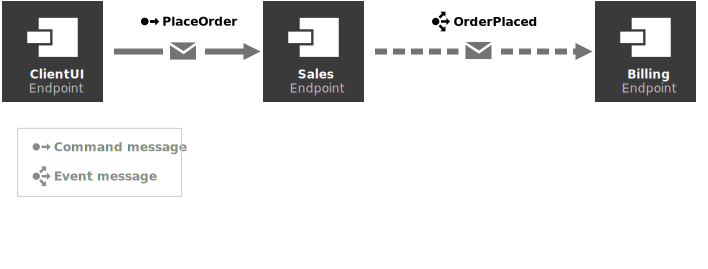

In this tutorial, you'll see firsthand how a software system built on asynchronous messaging using NServiceBus is superior to integrating with HTTP-based web services. You'll discover how using NServiceBus gives you the advantages of reliability and extensibility you just can't achieve building services as REST endpoints.

This tutorial will skip over some of the concepts and implementation details. If you'd prefer to dig in and really start to learn how to use NServiceBus, check out the [Introduction to NServiceBus](/tutorials/intro-to-nservicebus/). It will teach you the NServiceBus API as well as the important concepts of message-based systems you'll want to learn in order to build successful software systems.

To get started, download the solution above, extract the archive, and then open the **Before/RetailDemo.sln** file with Visual Studio 2015 or later.

## Project structure

The solution contains four projects. The **ClientUI**, **Sales**, and **Billing** projects are [messaging endpoints](/nservicebus/endpoints/), or processes that communicate with each other using NServiceBus messages. Each endpoint references the **Messages** assembly, which contains the definitions of messages as simple class files.

As shown in this diagram, the **ClientUI** endpoint, which serves as a stand-in for a web application in a more realistic example, will send a **PlaceOrder** command to the **Sales** endpoint. As a result, the **Sales** endpoint will publish an **OrderPlaced** event using the publish/subscribe pattern, which will be received by the **Billing** endpoint.

The solution mimics a real-life retail system, where the command to place an order occurs as a result of a customer interaction, and the actual processing occurs in the background. By publishing an event, the code to bill the credit card is isolated from the code to place the order, reducing coupling and making the system easier to maintain over the long term. Later in this tutorial, we'll see how to add a second subscriber in a **Shipping** endpoint which would begin the process of shipping the order.

## Running the solution

The solution is configured to have [multiple startup projects](https://msdn.microsoft.com/en-us/library/ms165413.aspx), so when you run the solution, it should open three console applications, one for each messaging endpoint.

In the **ClientUI** application, press `P` to place an order, and watch how the other windows react. It may happen too quickly for you to see, but **PlaceOrder** will be sent to **Sales** resulting in:

    INFO  Sales.PlaceOrderHandler Received PlaceOrder, OrderId = 9b16a5ce-e6ae-4447-a911-b7d6e265a1f0

As a result, the **OrderPlaced** event will be published, and the **Billing** window you will see:

    INFO  Billing.OrderPlacedHandler Billing has received OrderPlaced, OrderId = 9b16a5ce-e6ae-4447-a911-b7d6e265a1f0

Try pressing `P` repeatedly in the **ClientUI** window and watch the messages flow between endpoints.

## Chaos Monkey

One of the most powerful features of asynchronous messaging is that failures in one part of a system don't propagate and bring the whole system down. Let's give that a try.

1. Run the solution in Visual Studio and ensure all three console windows are active.
1. Close the **Billing** window.
1. Send several messages by pressing `P` in the **ClientUI** window.
1. Notice how messages are still flowing from **ClientUI** to **Sales**.
1. Restart the **Billing** application by right-clicking the **Billing** project in Visual Studio's Solution Explorer, then selecting **Debug** > **Start new instance**.

When the **Billing** endpoint starts back up, 